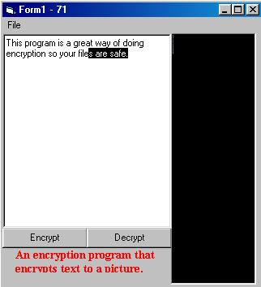



## Text To Picture Encryption

### Description

This prgram Encrypts text to a picture.

As you may notice its hard to see that picture box has anything but black.But it does if you zoom in.also each pixel in the picturebox holds 3 letters saving you alot of room your private letters on your computer are no longer able to be seen because everyone knows that ifmmp is hello so now you have a picture instead.Very Complex. Easy to understand.Highly commented.Easily made more complex.Check It Out.And PLEASE leave Comments and Vote.

Please Vote for this source code.

NOW UPDATED

http://www.planetsourcecode.com/xq/ASP/txtCodeId.28531/lngWId.1/qx/vb/scripts/ShowCode.htm
 
### More Info
 

             |
---                |---
**Submitted On**   |2001-10-28 14:21:46
**By**             |[Visualcode](https://github.com/Planet-Source-Code/PSCIndex/blob/master/ByAuthor/visualcode.md)
**Level**          |Intermediate
**User Rating**    |4.8 (19 globes from 4 users)
**Compatibility**  |VB 6\.0
**Category**       |[String Manipulation](https://github.com/Planet-Source-Code/PSCIndex/blob/master/ByCategory/string-manipulation__1-5.md)
**World**          |[Visual Basic](https://github.com/Planet-Source-Code/PSCIndex/blob/master/ByWorld/visual-basic.md)
**Archive File**   |[Text To Pi3179810292001\.zip](https://github.com/Planet-Source-Code/visualcode-text-to-picture-encryption__1-28506/archive/master.zip)

